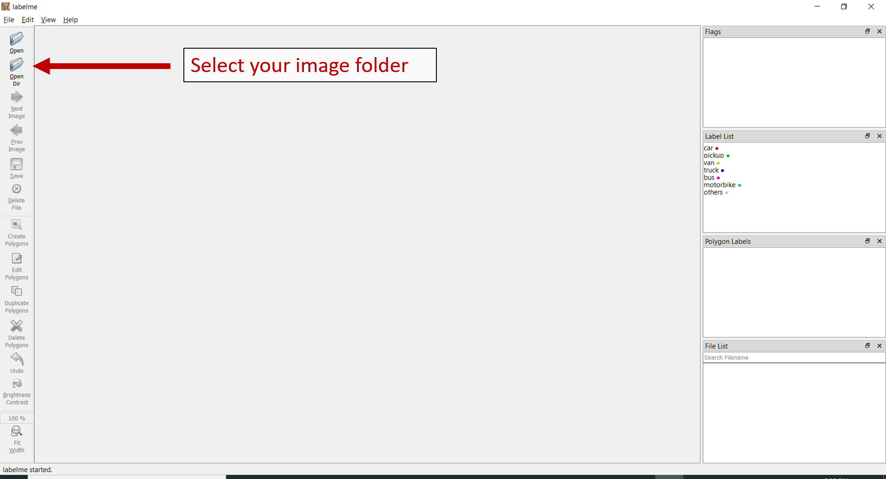
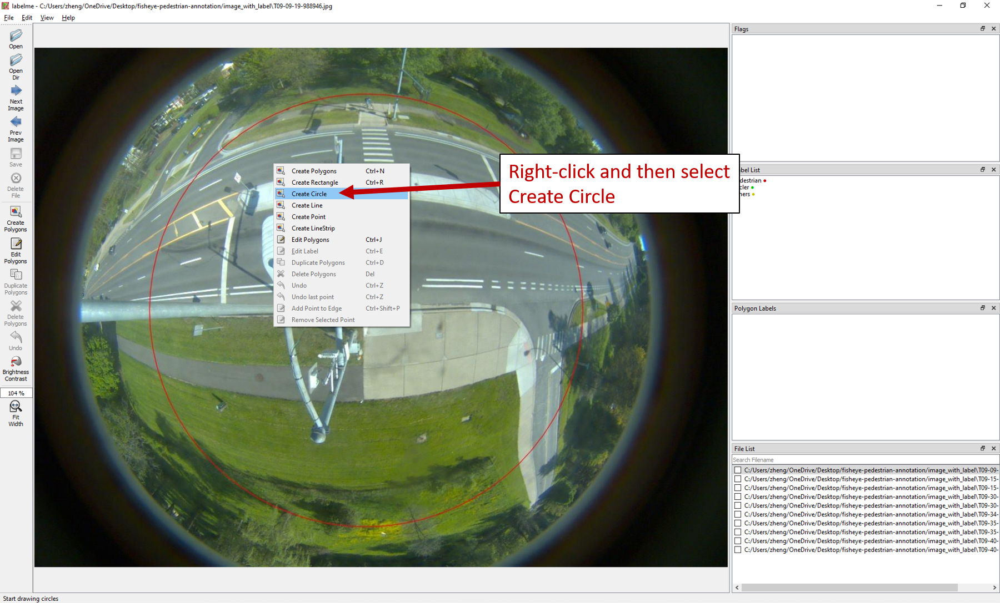
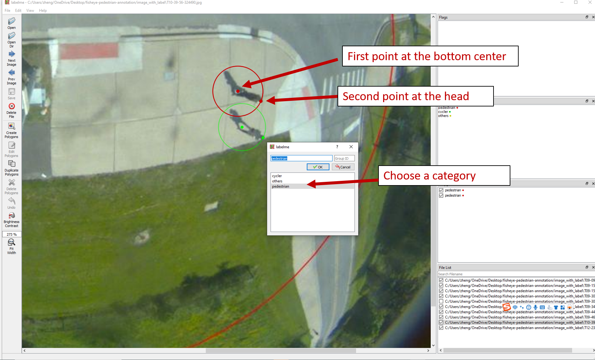
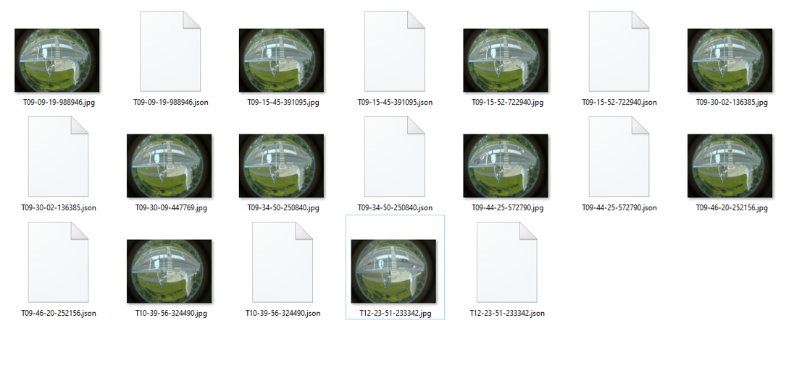

# Fisheye Image Pedestrian Annotation Tutorial

[Michigan Traffic Lab, University of Michigan](https://traffic.engin.umich.edu/)

This repo provides a toolbox for image annotation. It also provides a brief tutorial on how to label fisheye traffic images for traffic object detection. This repo is based on [Labelme](https://github.com/wkentaro/labelme), an open source graphical image annotation toolbox.


## Installation

Install [Anaconda](https://www.continuum.io/downloads) first, then run below to install [Labelme](https://github.com/wkentaro/labelme) and [opencv-python](https://pypi.org/project/opencv-python/):

```shell
conda create --name=labelme python=3.6
conda activate labelme
pip install labelme
pip install opencv-python
```

Clone this repo:

```shell
git clone https://github.com/shengyinshen/fisheye-pedestrian-annotation.git 
cd ./fisheye-pedestrian-annotation
```

## Usage

### Annotation

Activate anaconda environment and open the Labelme software interface:

```shell
cd ./fisheye-pedestrian-annotation
conda activate labelme
labelme --labels labels.txt --nodata --autosave
```

Please follow the steps below to annotate your images.

1. Select your image folder here. By default, the folder should be `./image_with_label`, which contains those images to be annotated.

   

2. Right-click and then select "Create Circle"

   

3. Annotate each pedestrian with two points - with the first point marked at the pedestrian's bottom center and the second point marked at the head.  Choose a category from the drop-down menu ("pedestrian", "cycler", and "others"). **Any pedestrians and cyclers within the red circle should be annotated**. 

   

4. When you finish labeling all pedestrians and cyclers within the valid area, click "Next Image" to move on to the next. The annotations will be saved automatically. You can skip those images if they don't have any objects of interests. Finally, all the annotations are saved as [JSON](http://www.json.org/) files in the same image directory. The following screenshot shows how your image folders will look like after annotating all images. You can reload them to check whether the annotations are correct. 

   


## Important things to know

1. Any pedestrians and cyclers within the red circle should be annotated. The pedestrians and cyclers located outside the circle should be ignored. 
2. When labeling the two points, please start from the pedestrain's bottom (usually the feet location) then move the pedestrain's head. Please DO NOT do this in the opposite order. 
3. You can use "Ctrl + scroll wheel" to zoom-in and zoom-out.
4. If you accidentally mislabeled any of the objects, try right-click --> "Edit Polygons" and "Edit Label" to correct them.
8. If you have any further questions, please contact Sean (shengyin@umich.edu) or Zhengxia (zzhengxi@umich.edu).
